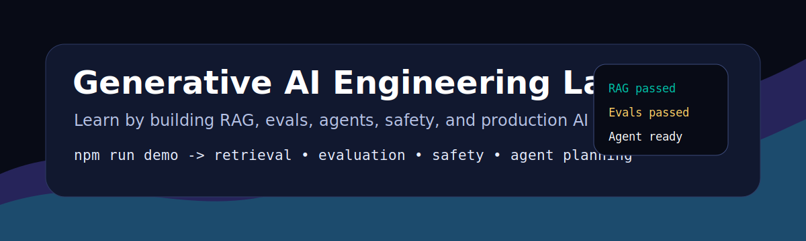

<div align="center">



# Generative AI Engineering Lab

### Learn Generative AI engineering by building the systems behind real products.

[](https://github.com/P-r-e-m-i-u-m/generative-ai-engineering-lab/actions/workflows/ci.yml)
[](LICENSE)
[](package.json)
[](tsconfig.json)
[](curriculum/README.md)

[Quick Start](#quick-start) . [What You Build](#what-you-build) . [Curriculum](curriculum/README.md) . [Good First Issues](docs/good-first-issues.md)

</div>

## Why This Repo Exists

Most people do not need another vague AI list. They need a practical path from idea to working system:

- retrieve trusted context
- generate grounded answers
- evaluate outputs
- scan safety risks
- plan agent workflows
- ship with tests and CI

This repo is small enough to understand, but structured like a serious open-source project.

## Quick Start

```bash
npm install
npm run check
```

Run demos one by one:

```bash
npm run demo:rag
npm run demo:evals
npm run demo:safety
npm run demo:agent
npm run eval:report
```

Run the website:

```bash
npm run site
```

Then open `http://localhost:4173`.

## What You Build

| Module | What It Teaches | Working Code |
| --- | --- | --- |
| RAG | Retrieval before generation, citations, confidence | `src/lab.ts` |
| Prompt Evals | Expected behavior, forbidden claims, scoring | `src/lab.ts` |
| Safety Scanner | PII, legal, medical, financial, self-harm risk | `src/lab.ts` |
| Agent Planner | Multi-step tool workflows and human handoff | `src/lab.ts` |
| Production Basics | CI, tests, docs, issue templates, roadmap | `.github/`, `tests/` |

## Demo Preview

```text
=== Generative AI Engineering Lab ===
rag: cited answer with confidence
evals: prompt quality test passed
safety: high-impact financial risk detected
agent: five-step workflow generated
```

## Repository Structure

```text
src/                      TypeScript implementation
site/                     Static website
tests/                    Smoke tests
curriculum/               Learning path
prompts/                  Reusable prompt templates
evals/                    Prompt evaluation cases
datasets/                 Sample local knowledge base
outputs/                  Reusable artifacts
docs/                     Roadmap, architecture, contribution ideas
.github/                  CI, issue templates, PR template
```

## Curriculum

The course path is intentionally practical:

1. GenAI foundations
2. Prompt engineering
3. RAG systems
4. Agentic workflows
5. Evals and safety
6. Production patterns

Every phase should produce an artifact: a prompt, eval, dataset, agent spec, or code change.

## Roadmap

- Add embedding-based retrieval.
- Add OpenAI/provider adapter while keeping mock/local mode.
- Add more eval cases.
- Add a small browser UI.
- Add MCP server example.
- Add lesson quizzes.
- Add hosted demo.

Current release: [v0.1.0](https://github.com/P-r-e-m-i-u-m/generative-ai-engineering-lab/releases/tag/v0.1.0)

## Contributing

Start with `docs/good-first-issues.md`.

The best first PRs:

- Add one lesson.
- Add one eval case.
- Add one sample dataset.
- Improve RAG ranking.
- Add a small CLI command.

## License

MIT. Fork it, learn from it, build on it.
